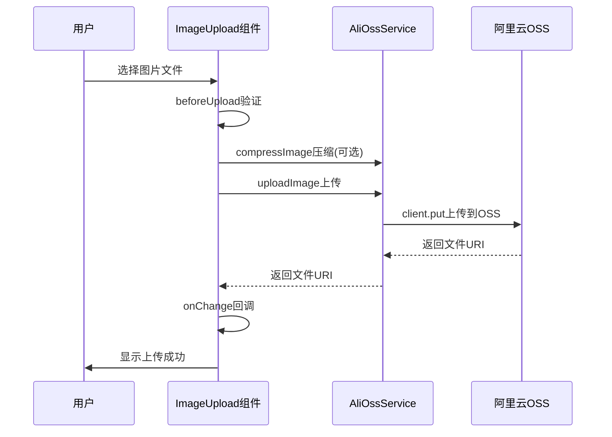
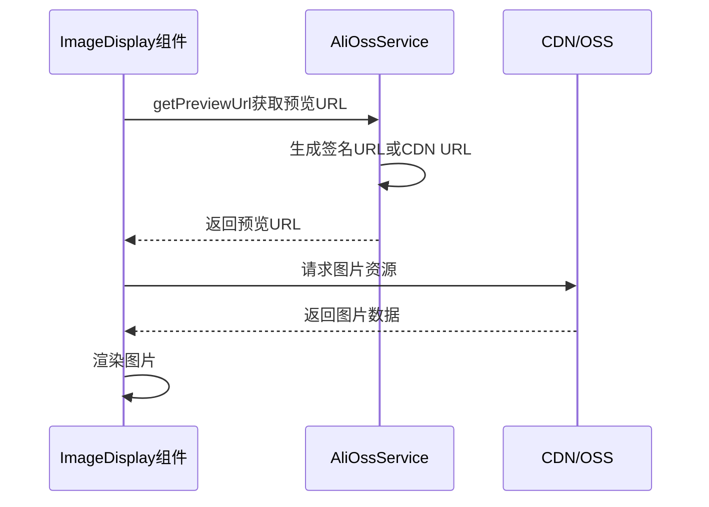

# 项目图片上传功能文档

## 概述

本项目实现了完整的图片上传功能，基于阿里云OSS存储服务，支持单图和多图上传、图片预览、压缩等功能。本文档详细介绍了如何使用图片上传功能以及相关的接口调用。

## 核心组件架构

### 1. 服务层 - AliOssService

**文件位置**: `src/services/aliOssService.ts`

这是图片上传的核心服务类，提供了完整的阿里云OSS操作功能。

#### 主要方法

```typescript
class AliOssService {
  // 上传单张图片
  async uploadImage(file: File): Promise<string>
  
  // 批量上传图片  
  async uploadImages(files: File[]): Promise<string[]>
  
  // 删除图片
  async deleteImage(uri: string): Promise<void>
  
  // 获取图片预览URL（支持不同尺寸）
  getPreviewUrl(uri: string, size?: 'small' | 'medium' | 'large'): string
  
  // 前端图片压缩
  async compressImage(file: File, quality: number = 0.8): Promise<File>
  
  // 检查配置是否完整
  isConfigured(): boolean
}
```

#### 配置要求

需要在环境变量中配置以下信息：

```bash
# .env 文件
REACT_APP_OSS_REGION=oss-cn-hangzhou
REACT_APP_OSS_ACCESS_KEY_ID=your_access_key_id
REACT_APP_OSS_ACCESS_KEY_SECRET=your_access_key_secret
REACT_APP_OSS_BUCKET=your-bucket-name
REACT_APP_CDN_DOMAIN=https://cdn.your-domain.com  # 可选
```

### 2. 图片上传组件 - ImageUpload

**文件位置**: `src/components/ImageComponents/ImageUpload/index.tsx`

这是主要的图片上传组件，基于Ant Design的Upload组件实现。

#### 组件属性

```typescript
interface ImageUploadProps {
  /** 当前值，可以是字符串或字符串数组 */
  value?: string | string[];
  /** 值变化回调 */
  onChange?: (value: string | string[] | undefined) => void;
  /** 图片配置 */
  config?: FieldConfig['imageConfig'];
  /** 最大文件数量 */
  maxCount?: number;
  /** 占位符文本 */
  placeholder?: string;
  /** 是否禁用 */
  disabled?: boolean;
}
```

#### 功能特性

- ✅ 支持拖拽上传
- ✅ 实时上传进度显示
- ✅ 图片预览和删除
- ✅ 文件格式和大小验证
- ✅ 支持单图/多图模式
- ✅ 图片压缩功能
- ✅ 错误处理和重试

#### 使用示例

```tsx
import { ImageUpload } from '@/components/ImageComponents';

// 单图上传
<ImageUpload
  value={imageUri}
  onChange={(uri) => setImageUri(uri)}
  maxCount={1}
  placeholder="请上传商品主图"
  config={{
    accept: 'image/*',
    maxSize: 5, // 5MB
    quality: 0.8, // 压缩质量
  }}
/>

// 多图上传
<ImageUpload
  value={imageUris}
  onChange={(uris) => setImageUris(uris)}
  maxCount={9}
  placeholder="请上传商品详情图"
  config={{
    accept: 'image/*',
    maxSize: 5,
    previewSize: 'medium',
  }}
/>
```

### 3. 图片显示组件 - ImageDisplay

**文件位置**: `src/components/ImageComponents/ImageDisplay/index.tsx`

用于在表格和详情页中显示图片。

#### 组件属性

```typescript
interface ImageDisplayProps {
  /** 图片值，可以是单个URI字符串或URI数组 */
  value?: string | string[];
  /** 图片配置 */
  config?: FieldConfig['imageConfig'];
  /** 最大文件数量 */
  maxCount?: number;
}
```

#### 使用示例

```tsx
import { ImageDisplay } from '@/components/ImageComponents';

// 在表格中显示缩略图
<ImageDisplay
  value={record.mainImage}
  config={{ previewSize: 'small' }}
  maxCount={1}
/>

// 在详情页显示多图
<ImageDisplay
  value={record.detailImages}
  config={{ previewSize: 'medium' }}
  maxCount={9}
/>
```

### 4. 图片编辑组件 - ImageEdit

**文件位置**: `src/components/ImageComponents/ImageEdit/index.tsx`

用于在可编辑表格中进行图片编辑。

## 低代码架构集成

### 1. 字段类型配置

在 `src/types/field-config.ts` 中，已经定义了图片字段类型：

```typescript
export type FieldType = 'ID' | '字符' | '数字' | '引用对象' | '值对象' | '实体对象' | '布尔' | '日期时间' | '日期' | '时间' | '审计信息' | '枚举' | '图片' | '动态字段模板' | '动态字段';

export interface FieldConfig<T = any> {
  // ... 其他属性
  /** 图片相关配置（仅用于 '图片' 类型） */
  imageConfig?: {
    /** 允许的文件类型 */
    accept?: string;
    /** 最大文件大小（MB） */
    maxSize?: number;
    /** 图片预览尺寸 */
    previewSize?: 'small' | 'medium' | 'large';
    /** 最大文件数量 */
    maxCount?: number;
    /** 图片压缩质量 */
    quality?: number;
  };
}
```

### 2. 表格列配置

在 `src/utils/columnUtils.tsx` 中，已经集成了图片字段的处理逻辑：

```typescript
case '图片':
  column.width = 200;
  
  // 只在编辑模式下配置 ImageEdit 组件
  if (field.editable === true && editable) {
    column.renderFormItem = () => (
      <ImageEdit
        config={field.imageConfig}
        maxCount={field.imageConfig?.maxCount || 1}
        placeholder={`请上传${field.name}`}
      />
    );
  }
  
  column.render = (_, record) => {
    const fieldValue = getValueByDataIndex(record, field.dataIndex);
    return (
      <ImageDisplay
        value={fieldValue}
        config={field.imageConfig}
        maxCount={field.imageConfig?.maxCount || 1}
      />
    );
  };
  break;
```

### 3. 在页面中使用图片字段

在 `columns-config.ts` 文件中配置图片字段：

```typescript
// 单图配置示例
{
  name: '商品主图',
  dataIndex: 'mainImage',
  type: '图片',
  isRef: false,
  creatable: true,
  editable: true,
  editService: async (id: string, data: any) => {
    return await updateProductMainImage(id, { mainImage: data.mainImage });
  },
  imageConfig: {
    accept: 'image/*',
    maxSize: 5,
    previewSize: 'medium',
    maxCount: 1,
    quality: 0.8,
  },
}

// 多图配置示例
{
  name: '商品详情图',
  dataIndex: 'detailImages',
  type: '图片',
  isRef: false,
  creatable: true,
  editable: true,
  editService: async (id: string, data: any) => {
    return await updateProductDetailImages(id, { detailImages: data.detailImages });
  },
  imageConfig: {
    accept: 'image/*',
    maxSize: 5,
    previewSize: 'medium',
    maxCount: 9,
    quality: 0.8,
  },
}
```

## 接口调用流程

### 1. 图片上传流程



### 2. 图片显示流程



### 3. 核心API调用

#### 上传图片

```typescript
import aliOssService from '@/services/aliOssService';

// 上传单张图片
const uploadSingleImage = async (file: File) => {
  try {
    const uri = await aliOssService.uploadImage(file);
    console.log('上传成功，文件URI:', uri);
    return uri;
  } catch (error) {
    console.error('上传失败:', error);
    throw error;
  }
};

// 批量上传图片
const uploadMultipleImages = async (files: File[]) => {
  try {
    const uris = await aliOssService.uploadImages(files);
    console.log('批量上传成功，文件URIs:', uris);
    return uris;
  } catch (error) {
    console.error('批量上传失败:', error);
    throw error;
  }
};
```

#### 获取图片预览URL

```typescript
import aliOssService from '@/services/aliOssService';

// 获取不同尺寸的预览URL
const getImageUrls = (uri: string) => {
  return {
    thumbnail: aliOssService.getPreviewUrl(uri, 'small'),    // 200px宽度
    medium: aliOssService.getPreviewUrl(uri, 'medium'),      // 800px宽度
    large: aliOssService.getPreviewUrl(uri, 'large'),        // 1600px宽度
    original: aliOssService.getPreviewUrl(uri),              // 原图
  };
};
```

#### 删除图片

```typescript
import aliOssService from '@/services/aliOssService';

// 删除图片
const deleteImage = async (uri: string) => {
  try {
    await aliOssService.deleteImage(uri);
    console.log('删除成功');
  } catch (error) {
    console.error('删除失败:', error);
    throw error;
  }
};
```

#### 图片压缩

```typescript
import aliOssService from '@/services/aliOssService';

// 压缩图片
const compressImage = async (file: File, quality: number = 0.8) => {
  try {
    const compressedFile = await aliOssService.compressImage(file, quality);
    console.log('压缩成功，原大小:', file.size, '压缩后:', compressedFile.size);
    return compressedFile;
  } catch (error) {
    console.error('压缩失败:', error);
    throw error;
  }
};
```

## 配置和部署

### 1. 阿里云OSS配置

#### 创建Bucket

1. 登录阿里云控制台
2. 进入OSS管理控制台
3. 创建Bucket，建议配置：
   - 读写权限：私有（推荐，通过签名访问）
   - 存储类型：标准存储
   - 开启图片处理服务

#### 配置RAM用户

1. 创建RAM用户，只授予OSS相关权限
2. 获取AccessKey ID和AccessKey Secret
3. 配置最小权限策略：

```json
{
  "Version": "1",
  "Statement": [
    {
      "Effect": "Allow",
      "Action": [
        "oss:PutObject",
        "oss:GetObject", 
        "oss:DeleteObject",
        "oss:ListObjects",
        "oss:GetObjectMeta",
        "oss:PostObject"
      ],
      "Resource": [
        "acs:oss:*:*:your-bucket-name",
        "acs:oss:*:*:your-bucket-name/*"
      ]
    }
  ]
}
```

### 2. CDN配置（可选）

配置CDN可以提升图片访问速度：

1. 创建CDN加速域名
2. 源站设置为OSS域名
3. 配置缓存规则：
   - 图片文件：30天缓存
   - 处理后图片：7天缓存

### 3. 环境变量配置

```bash
# 必需配置
REACT_APP_OSS_REGION=oss-cn-hangzhou
REACT_APP_OSS_ACCESS_KEY_ID=your_access_key_id
REACT_APP_OSS_ACCESS_KEY_SECRET=your_access_key_secret
REACT_APP_OSS_BUCKET=your-bucket-name

# 可选配置
REACT_APP_CDN_DOMAIN=https://cdn.your-domain.com
```

## 最佳实践

### 1. 图片优化

- **压缩质量**: 建议设置为0.8，平衡文件大小和图片质量
- **尺寸限制**: 上传前压缩到合理尺寸（如1920x1080）
- **格式选择**: 优先使用WebP格式（如果浏览器支持）

### 2. 性能优化

- **懒加载**: 使用Ant Design Image组件的懒加载功能
- **缩略图**: 在列表页使用小尺寸预览，详情页使用大尺寸
- **CDN缓存**: 配置合理的缓存策略

### 3. 安全考虑

- **权限控制**: 使用RAM子用户，避免主账号密钥
- **文件验证**: 严格验证文件类型和大小
- **访问控制**: 使用签名URL控制图片访问权限

### 4. 错误处理

```typescript
// 统一的错误处理
const handleImageUpload = async (file: File) => {
  try {
    // 检查配置
    if (!aliOssService.isConfigured()) {
      throw new Error('OSS配置不完整，请检查环境变量');
    }
    
    // 上传图片
    const uri = await aliOssService.uploadImage(file);
    return uri;
  } catch (error) {
    // 记录错误日志
    console.error('图片上传失败:', error);
    
    // 用户友好的错误提示
    if (error.message.includes('配置')) {
      message.error('系统配置错误，请联系管理员');
    } else if (error.message.includes('网络')) {
      message.error('网络连接失败，请检查网络后重试');
    } else {
      message.error('上传失败，请重试');
    }
    
    throw error;
  }
};
```

## 故障排除

### 1. 常见问题

**上传失败**：
- 检查OSS配置是否正确
- 验证网络连接
- 确认文件格式和大小符合要求

**图片无法显示**：
- 检查图片URI是否正确
- 验证OSS访问权限
- 确认CDN配置（如果使用）

**权限错误**：
- 检查RAM用户权限
- 验证Bucket访问权限
- 确认CORS配置

### 2. 调试工具

```typescript
// 开启OSS客户端调试
const client = new OSS({
  // ... 配置
  timeout: 60000,
  retryMax: 3,
});

// 监听请求和响应
client.on('request', (req) => {
  console.log('OSS Request:', req);
});

client.on('response', (res) => {
  console.log('OSS Response:', res);
});
```

## 总结

本项目的图片上传功能具有以下特点：

1. **完整的功能**: 支持上传、预览、删除、压缩等完整功能
2. **低代码集成**: 与现有低代码架构无缝集成
3. **高性能**: 支持CDN加速和图片处理
4. **安全可靠**: 完善的权限控制和错误处理
5. **易于使用**: 简单的API和丰富的配置选项

通过本文档，您可以快速了解和使用项目中的图片上传功能，并根据实际需求进行配置和扩展。
